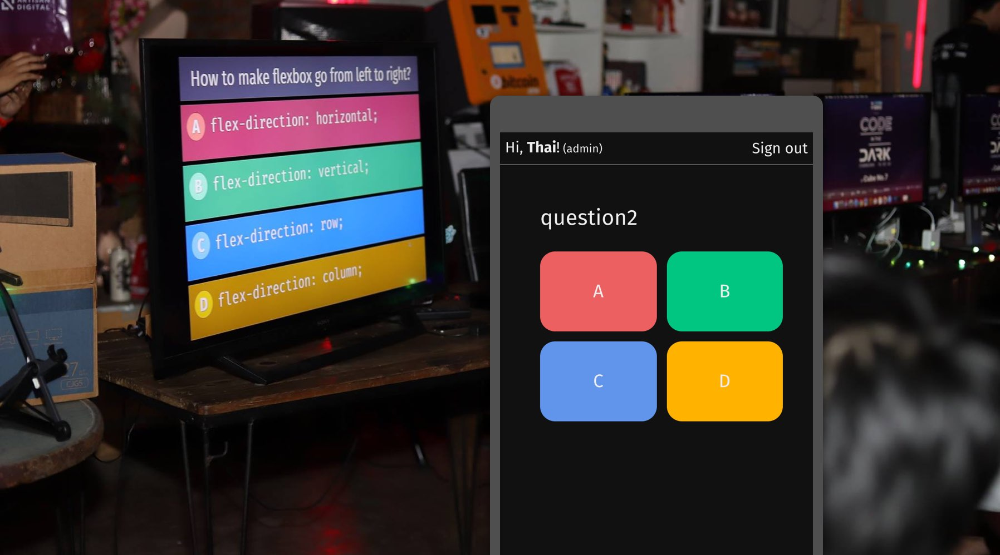
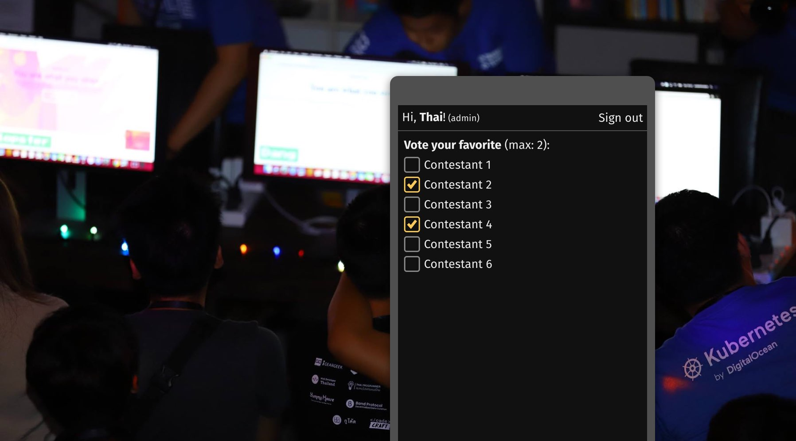
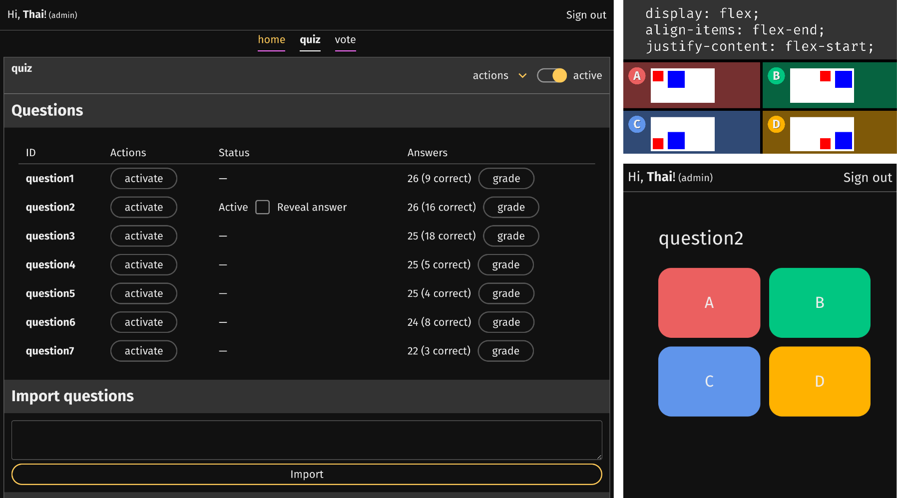
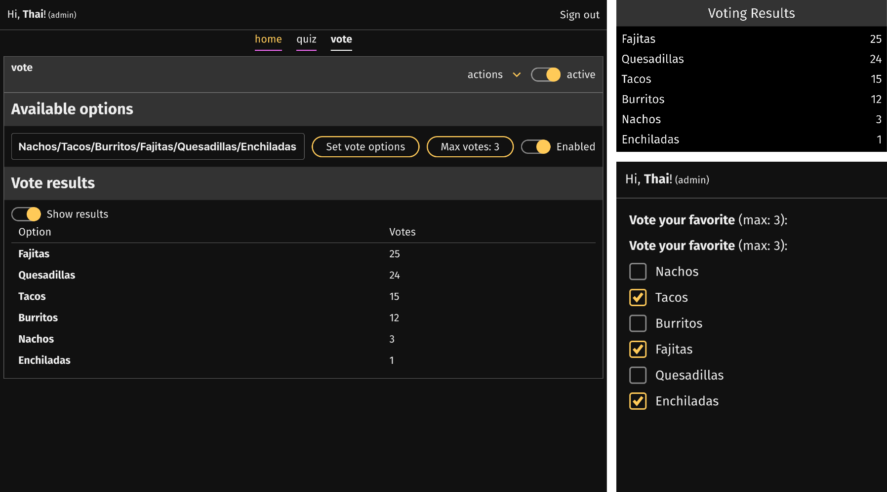

# auden

**auden** is an **open-source, hackable audience engagement software**,
supporting multiple features, such as **Live quiz** and **Voting system**. Its
hackable architecture allows developer to modify and add features to fit the
event.

We used **auden** in _[Code in the Dark](http://codeinthedark.com/) Thailand #3:
CNX 2019_ to encourage attendees to participate in the event more easily.

Instead of requiring all contestants to register beforehand (which takes quite a
courage), a **live quiz** system allows anyone in the event to compete to become
a contestant in each round.

Because this app supports multiple features, when it’s time for voting,
attendees can vote on the same webpage without the need to switch between
multiple apps (such as Mentimeter, Slido, and Kahoot).

## Feature tour

Each feature (called **scene**) contains 3 user-facing
[components](https://reactjs.org/docs/components-and-props.html):

- The **Audience** component is a mobile UI for audience to engage in the event.
- The **Presentation** component displays what the audience will see on the big
  screen.
- The **Backstage** component allows event staff to manipulate the scene (such
  as activating a question, displaying scoreboard, etc.)

### `quiz`

Play a multiple-choice quiz game with any number of participants, similar to
Kahoot.

### `vote`

Create a live poll to gather audience’s opinion, similar to Mentimeter.

## Technical

It is a webapp, built on top of:

- React!
- TypeScript!
- Grommet!
- Firebase Real-time Database!
- fiery :fire:!
- Hooks and Suspense!

## Set up Firebase project

1. **Set up Firebase Authentication** to allow sign in using Facebook.

2. **Sign in** using the web app, and obtain the Firebase user ID by running
   `firebase.auth().currentUser.uid` in the JavaScript console.

3. **Make the user an admin** by writing `true` Firebase Database at
   `/admins/$uid`. Admin users can read and write anything.

## Data model

### Scene

Everything is organized into “scenes,” which represents a type of situation in
an event.

For example, you can have a scene for a quiz, for a survey, for voting, for
announcements, and an idle scene when there’s nothing interesting going on.

Each scene has:

- A state schema and security rules, stored in `database.rules.bolt`,
  representing how data in that scene looks like. It has to be deployed to
  Firebase.
- A state, stored in Firebase.
- A presentation display, for projecting to a large screen.
- A audience UI to let audience engage with the event from their mobile phone
  (or desktop).
- A backstage UI to manipulate the scene.

That can be one active scene at a given time.
